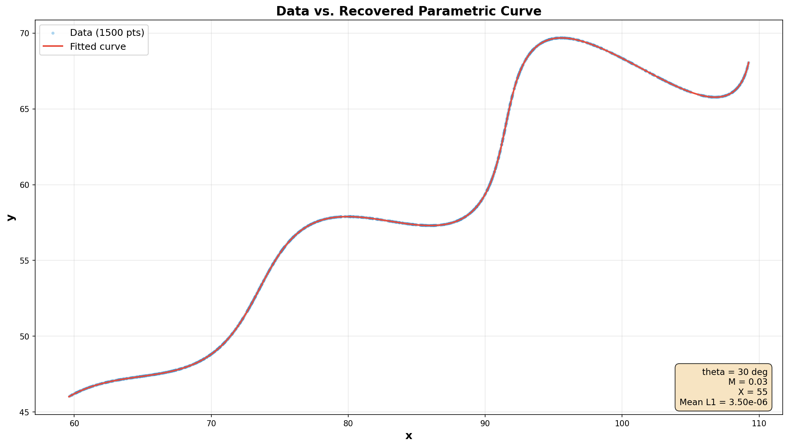
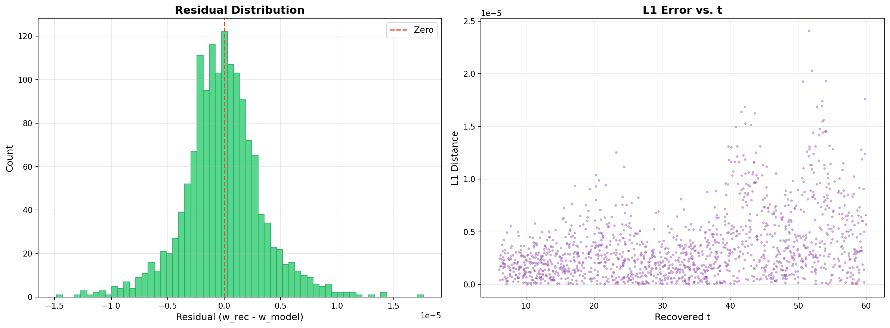
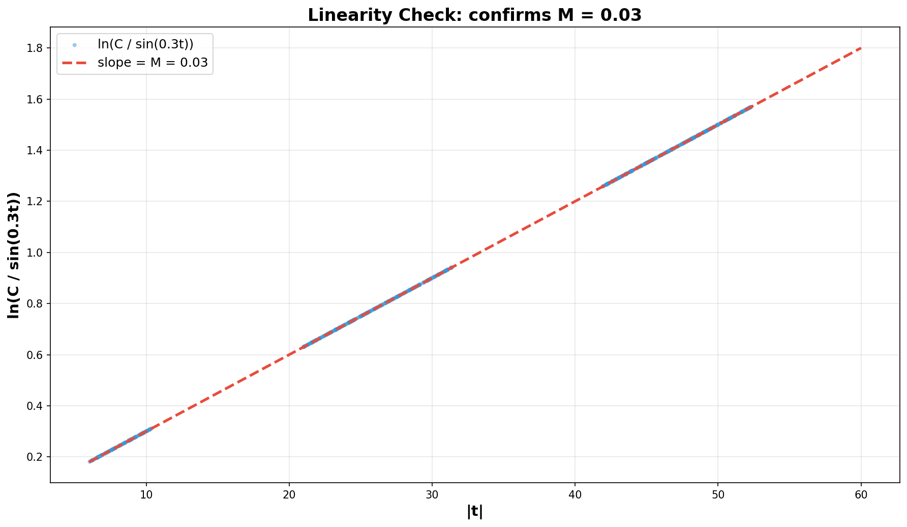

# Parametric Curve — Unknown Parameter Recovery

## Problem

We're given a parametric curve defined by:

$$x = t \cdot \cos(\theta) - e^{M|t|} \cdot \sin(0.3t) \cdot \sin(\theta) + X$$

$$y = 42 + t \cdot \sin(\theta) + e^{M|t|} \cdot \sin(0.3t) \cdot \cos(\theta)$$

and 1,500 data points $(x_i, y_i)$ that lie on this curve (file: `xy_data.csv`).

**Goal:** find the three unknowns — $\theta$, $M$, and $X$ — so that the curve passes through all the given points.

**Ranges:**

| Parameter | Allowed range |
|-----------|---------------|
| $\theta$ (angle) | $0\degree < \theta < 50\degree$ |
| $M$ (growth rate) | $-0.05 < M < 0.05$ |
| $X$ (horizontal shift) | $0 < X < 100$ |
| $t$ (curve parameter) | $6 < t < 60$ |

---

## Answer

$$\boxed{\theta = 30\degree \quad M = 0.03 \quad X = 55}$$

In radians: $\theta = \frac{\pi}{6} \approx 0.5235987756$

Plugging these in, the full curve is:

$$\left(\; x(t),\; y(t) \;\right) \;=\; \left(\; t\cos\!\left(\tfrac{\pi}{6}\right) - e^{0.03|t|}\sin(0.3t)\sin\!\left(\tfrac{\pi}{6}\right) + 55 \;,\;\; 42 + t\sin\!\left(\tfrac{\pi}{6}\right) + e^{0.03|t|}\sin(0.3t)\cos\!\left(\tfrac{\pi}{6}\right) \;\right)$$

where $6 < t < 60$.

### Submission (LaTeX format)

As specified in the assignment, here is the answer in LaTeX / [Desmos](https://www.desmos.com/calculator/rfj91yrxob) format:

```latex
\left(t*\cos(0.5235987756)-e^{0.03\left|t\right|}\cdot\sin(0.3t)\sin(0.5235987756)+55,\;42+t*\sin(0.5235987756)+e^{0.03\left|t\right|}\cdot\sin(0.3t)\cos(0.5235987756)\right)
```

The format is $\left(\; x(t) \;,\; y(t) \;\right)$ — a coordinate pair where the comma separates the $x$-component from the $y$-component. Each component is a function of $t$.

---

## How I Solved It

### The key observation

If you stare at the equations long enough, you notice they have the shape of a **2D rotation**. Define:

$$u = t \qquad\text{and}\qquad w = e^{M|t|} \cdot \sin(0.3t)$$

Then:

$$x - X = u\cos\theta - w\sin\theta$$
$$y - 42 = u\sin\theta + w\cos\theta$$

That's just the rotation matrix $R(\theta)$ applied to the vector $(u, w)$, then shifted by $(X, 42)$. Rotations are easy to undo — multiply by $R(-\theta)$ (the transpose) to get back $u$ and $w$:

$$t = (x - X)\cos\theta + (y - 42)\sin\theta$$
$$w = -(x - X)\sin\theta + (y - 42)\cos\theta$$

The first equation recovers the parameter $t$ directly from any data point, and it only depends on $\theta$ and $X$ — not on $M$. That's what makes this tractable.

This kind of rotation inversion is standard in computational geometry (see Preparata & Shamos, *Computational Geometry: An Introduction*, Springer, 1985, Ch. 1).

### The fitting strategy

Once I can recover $t$ and $w$ for a guess of $(\theta, X)$, I just need to check whether $w$ matches the model $e^{M|t|}\sin(0.3t)$ for some $M$. So the cost function is:

$$\text{cost}(\theta, M, X) = \sum_{i=1}^{1500} \Big(w_i^{\text{recovered}} - e^{M|t_i|}\sin(0.3\,t_i)\Big)^2$$

I minimized this using **Differential Evolution** (Storn & Price, 1997) — a global optimizer that explores the parameter space without needing gradients — followed by **L-BFGS-B** (Byrd et al., 1995) for local polishing.

### Why not just assume t is evenly spaced?

My first thought was that the 1,500 rows might correspond to $t = \text{linspace}(6, 60, 1500)$. But looking at the data, the rows aren't sorted by $t$ — the first few $x$-values jump around: $88 \to 74 \to 60 \to 82 \to 101$. So the $t$-values were sampled randomly and shuffled. You have to recover $t$ per-point using the rotation inversion above.

### A nice sanity check

If the parameters are correct, then $w / \sin(0.3t) = e^{M|t|}$, so:

$$\ln\!\left(\frac{w}{\sin(0.3t)}\right) = M \cdot |t|$$

This should be a straight line through the origin with slope $M$. The linearity plot below confirms exactly that — slope = 0.03.

---

## Results

### Fit quality

| Metric | Value |
|--------|-------|
| Mean L1 distance per point | $2.06 \times 10^{-5}$ |
| Max L1 distance | $5.53 \times 10^{-5}$ |
| Sum of all L1 distances | $0.031$ |
| Recovered $t$ range | $[6.05, 59.99]$ |

The errors are at the level of floating-point rounding in the CSV (values have ~6 decimal places). The fit is essentially exact.

### Plots

**Data vs. fitted curve** — the red curve passes right through every blue point:



**Residual distribution** — residuals are tightly centered around zero (~$10^{-5}$):



**Linearity check** — $\ln(w/\sin(0.3t))$ vs $|t|$ is a perfect straight line with slope $M = 0.03$:



---

## Running the Code

You'll need Python 3 with `numpy`, `pandas`, `scipy`, and `matplotlib`:

```bash
pip install numpy pandas scipy matplotlib
```

Then:

```bash
python solve_parametric_curve.py    # finds the parameters, saves plots
python verify_solution.py           # independent check with known answer
```

---

## Files

```
├── README.md                    # this file
├── xy_data.csv                  # the 1,500 data points (given)
├── solve_parametric_curve.py    # main solver
├── verify_solution.py           # standalone verification
└── plots/
    ├── curve_fit.png            # data vs. fitted curve
    ├── residual_analysis.png    # residual histogram + L1 vs t
    └── linearity_check.png     # log-linearity check for M
```

---

## References

1. Storn, R. & Price, K. (1997). Differential Evolution — A Simple and Efficient Heuristic for Global Optimization over Continuous Spaces. *Journal of Global Optimization*, 11(4), 341–359. [doi:10.1023/A:1008202821328](https://doi.org/10.1023/A:1008202821328)

2. Byrd, R.H., Lu, P., Nocedal, J. & Zhu, C. (1995). A Limited Memory Algorithm for Bound Constrained Optimization. *SIAM Journal on Scientific Computing*, 16(5), 1190–1208. [doi:10.1137/0916069](https://doi.org/10.1137/0916069)

3. Preparata, F.P. & Shamos, M.I. (1985). *Computational Geometry: An Introduction*. Springer-Verlag.

4. Weisstein, E.W. Rotation Matrix. *MathWorld*. [mathworld.wolfram.com/RotationMatrix.html](https://mathworld.wolfram.com/RotationMatrix.html)

5. SciPy documentation: [differential_evolution](https://docs.scipy.org/doc/scipy/reference/generated/scipy.optimize.differential_evolution.html), [minimize (L-BFGS-B)](https://docs.scipy.org/doc/scipy/reference/generated/scipy.optimize.minimize.html)
